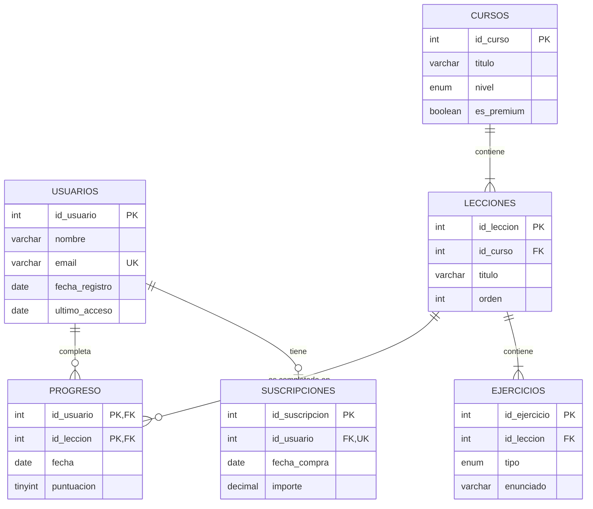

# Yallah Database

Diseño de una **base de datos relacional en MySQL** para *Yallah: Aprende Darija*, una app para aprender árabe marroquí dirigida a hispanohablantes.

El proyecto cubre todo el ciclo: modelo entidad-relación, creación del esquema con claves primarias y foráneas, carga de datos de ejemplo y consultas que responden a preguntas reales sobre el uso de la app.

> **Nota:** es un proyecto de práctica de diseño relacional. La versión real de la app está planificada con Firebase (base de datos NoSQL).

## Modelo entidad-relación



## Decisiones de diseño

- **`progreso`** resuelve la relación N:M entre usuarios y lecciones. Su clave primaria compuesta `(id_usuario, id_leccion)` impide registrar dos veces la misma lección para un usuario.
- **`suscripciones`** tiene `id_usuario` como `UNIQUE` porque el premium es un pago único: cada usuario puede tener como máximo una.
- Las claves foráneas usan **`ON DELETE CASCADE`**: si se borra un usuario, se borran también su progreso y su suscripción, sin dejar datos huérfanos.
- **`CHECK`** en la puntuación para que solo acepte valores entre 0 y 100.
- **`UNIQUE (id_curso, orden)`** evita que dos lecciones de un mismo curso tengan la misma posición.

## Estructura

| Archivo | Contenido |
|---|---|
| `01_schema.sql` | Creación de la base de datos y de las 6 tablas |
| `02_datos.sql` | Datos de ejemplo |
| `03_consultas.sql` | 14 consultas comentadas |

## Consultas incluidas

Algunas de las preguntas que responden las consultas:

- ¿Cuántas lecciones ha completado cada usuario? (`LEFT JOIN` + `GROUP BY`)
- ¿Qué lecciones tienen peor nota media y pueden ser demasiado difíciles? (`AVG` + `ORDER BY`)
- ¿Qué porcentaje de cada curso lleva completado cada usuario? (subconsultas correlacionadas)
- ¿Qué usuarios superan la nota media general? (`HAVING` + subconsulta)
- ¿Hay usuarios accediendo a contenido premium sin haber pagado? (control de integridad)
- ¿Qué usuarios llevan más de 30 días sin entrar?

## Cómo ejecutarlo

En MySQL 8, ejecuta los archivos en orden:

```bash
mysql -u root -p < 01_schema.sql
mysql -u root -p < 02_datos.sql
mysql -u root -p < 03_consultas.sql
```

O ábrelos en MySQL Workbench y ejecútalos uno tras otro.

## Tecnologías

MySQL 8 · SQL (DDL y DML)

---

Proyecto de **El Mehdi Essaqal** · Estudiante de ASIR
